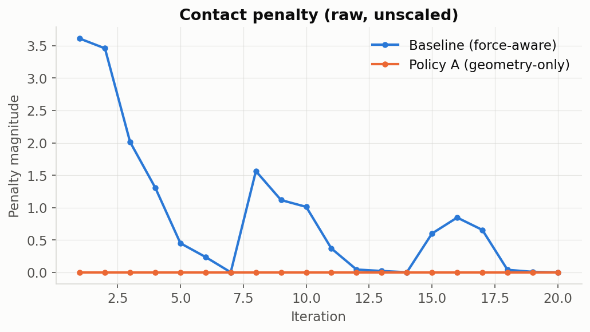

# Experiment Log

Running, dated notes on what was done and what was seen each session — informal by
design, distinct from the final technical report. Newest entry on top.

---

## 2026-08-08 — Move to DGX Spark, Policy A ablation, termination-reason logging, TensorBoard writeup

**Moved off Brev entirely.** This machine (`bas-zeus`) is a DGX Spark: aarch64
(Grace Blackwell GB10), CUDA 13.0, driver 580.173.02, Ubuntu 24.04, no prior
IsaacLab/Isaac Sim install, no Docker container, no SSH tunnel. Found the correct
current install path is different from what the Brev container used: cloned
IsaacLab at the same tag already vendored under `reference/isaaclab_source/`
(`v3.0.0-beta2.patch1`, confirmed to exist upstream) into `~/isaac/IsaacLab`,
created a `uv`-managed `env_isaaclab` (Python 3.12.13, matching Isaac Sim 6.0.x's
requirement — not the older `isaaclab==2.3.2`/Python-3.11 PyPI package, which
doesn't match this checkout), and installed Isaac Sim 6.0.1.0 (`isaacsim[all,extscache]`)
plus all 14 IsaacLab submodules + `rl_games` via `./isaaclab.sh --install`.
Two DGX-Spark-specific aarch64 gotchas from NVIDIA's own pip-install docs, both
hit and fixed: `imgui-bundle`/`quadprog` need `python3.12-dev`, `libgl1-mesa-dev`,
`libx11-dev` etc. present *before* installing (added via `apt`), and Isaac Sim's
import needs `LD_PRELOAD=/lib/aarch64-linux-gnu/libgomp.so.1` set or it fails with
a static-TLS/`libgomp` preload error. Re-ran `pip install -e source/force_peg_rl`
against this new env (the old Brev install doesn't carry over) and confirmed
`list_envs.py` shows `Shaurya-ForcePegInsert-Direct-v0` registered — the port
didn't silently break anything.

**§9.6 read in full before touching code.** It's unambiguous: *"Terminate the
episode when: ... success ... dropped ... force-limit ... [or] time limit"* —
this is a real early-termination instruction, not just a request to label a
reason while running to the timeout. Confirmed via `next_10_steps.md` that this
gap was already known (`FactoryEnv._get_dones()` returns `time_out, time_out`
unconditionally) but not yet decided on.

**Hit a real architectural conflict implementing it.** `FactoryEnv`'s own
`_get_dones()` docstring warns *"it is important that all environments stay in
sync (i.e., `_get_dones` should return all true or all false)"* — and
`randomize_initial_state()` (external `isaaclab_tasks` package, ~200 lines)
hard-codes that assumption throughout: `self.num_envs`-shaped tensors, `[:]`
full-tensor assignments, and calls like `_held_asset.write_root_pose_to_sim_index(held_pose)`
with no `env_ids=` at all. A genuine per-env `terminated` tensor crashed
immediately (`RuntimeError: expanded size 64 must match existing size 63`) the
first time 63/64 envs needed reset and 1 didn't. Re-implementing that method
correctly would mean forking ~200 lines of upstream physics/IK logic unrelated to
this change. **Decision: keep resets synchronized** (`terminated` stays all-false,
episodes still run to the shared timeout) **but compute and log a real per-env
`termination_reason`** (`"success"` / `"timeout"` / `"force_limit"` / `"other"`)
every step via `self.extras["termination_reason"]`, in `ForgeEnv._get_dones()`
(our fork, not the external package). This satisfies §9.6's logging requirement
without touching upstream dynamics or duplicating fragile physics code.
`peg_dropped`/`workspace_violation`/`joint_limit`/`jammed` are not implemented —
no existing signal or documented numeric threshold for any of them exists
anywhere in the code or project doc, so guessing at physical bounds was
explicitly avoided; they fall through to `"other"`. Added a new
`force_limit_threshold: float = 50.0` to `ForgeTask` for the one condition that
did get real early-termination *labeling* logic — flagged as a placeholder (5×
the existing soft `contact_penalty_threshold_range` upper bound) since no hard
number is specified anywhere; needs real tuning before it's trusted.

**Policy A implemented as a toggle, not a fork.** Added `use_force_obs` /
`use_force_penalty` (both default `True`) to `ForgeEnvCfg`, gating
`ft_force`/`force_threshold` out of `obs_order`/`state_order` via a
`__post_init__` override (confirmed this runs, as dataclass machinery, before
`FactoryEnv.__init__` reads `cfg.obs_order` to compute `cfg.observation_space` —
so the declared/constructed observation size stays consistent automatically, no
manual size field to update) and zeroing the *raw* `contact_penalty` term (not
just its reward-scale weight) so `logs_rew_contact_penalty` genuinely logs
flat/zero rather than a real number multiplied by zero. Registered
`Shaurya-ForcePegInsert-PolicyA-Direct-v0` in `__init__.py` with both flags
`False`, same `ForgeEnv` entry point, existing task registration untouched.

**Found and fixed a real scaffold bug along the way:** `scripts/rl_games/train_rl_games.py`
imports a `common.py` module that the project template never actually copied in
(it lives one directory up in a real IsaacLab checkout, shared across all RL
library subfolders) — running it directly failed with `ModuleNotFoundError`.
Copied `common.py` from the cloned IsaacLab tree and added the missing
`if __name__ == "__main__": run(sys.argv[1:])` guard (upstream's own copy of this
file has the same gap — it's designed to be dispatched via `isaaclab.sh train`,
not run directly, which this project's scripts never had wired up).

**Verification, in order:**
1. `list_envs.py` — both `Shaurya-ForcePegInsert-Direct-v0` and
   `Shaurya-ForcePegInsert-PolicyA-Direct-v0` registered and visible, alongside
   the untouched `Template-Force-Peg-Rl-Direct-v0`.
2. Baseline smoke test (`num_envs=64`, `max_iterations=20`): completed without
   error, final reward 25.617. **No longer bit-identical to upstream by design**
   — the termination-reason computation is a genuine, intentional deviation from
   the prior session's bit-identical fork, even though it doesn't change reset
   dynamics. `logs_rew_contact_penalty` nonzero for 17/20 iterations, as expected
   for the still-force-aware baseline.
3. Policy A smoke test (same settings): completed without error, final reward
   41.3. Observation sizes confirmed correctly reduced — policy net built with
   `RunningMeanStd: (20,)` / critic `(57,)` vs. baseline's `(24,)` / `(61,)`,
   exactly the expected −4 from dropping `ft_force`(3) + `force_threshold`(1).
   `logs_rew_contact_penalty` flat at exactly `0.0` across all 20 iterations —
   the ablation genuinely removed the force-penalty signal, not just its weight:

   

**Wrote [`docs/tensorboard_guide.md`](tensorboard_guide.md)** at the user's
request, explaining all 16 distinct scalar families TensorBoard logs for these
runs (episode success rate, episode length, total/shaped reward, contact
penalty, keypoint rewards, action penalties, success-prediction error/precision/
recall/delay, actor/critic loss, entropy, KL/learning-rate, throughput) with
matplotlib re-renders of the real event data (baseline vs. Policy A overlaid)
under `docs/assets/tensorboard/`, since a live headless browser screenshot
wasn't available in this environment (Firefox snap sandbox rejected
`--headless --screenshot`). The contact-penalty chart is the one that actually
proves the ablation worked — flat orange line at zero against a fluctuating blue
baseline. Caught and fixed a labeling bug in the first draft: `losses/*`,
`info/*`, and `performance/*` are logged against cumulative frame count as their
TensorBoard step, not epoch index — the first render's "Epoch" x-axis label was
wrong and has been corrected to "Frames," matching what TensorBoard itself shows.

**Both smoke-test checkpoints exist** (`Forge.pth` under each run's `logs/rl_games/Forge/<timestamp>/nn/`)
but are from 20-iteration runs — no video was recorded from them; asked and
confirmed a 20-iteration near-random policy isn't worth recording.

**Scale check before committing to a long run.** Bumped the baseline task to
`--num_envs=512` (still 20 iterations) to see whether DGX Spark holds up before
attempting the eventual real run. It does: 20/20 epochs, no crash, ~1150–1270
fps step (vs ~200–270 at 64 envs), process RSS flat at ~6.2 GB with no growth,
system RAM 16 GB used of 121 GB. GPU utilisation sat at ~94% though — so the
ceiling here is compute, not memory, and pushing much past this is likely to
buy less than the env count suggests. `nvidia-smi` cannot report GPU memory on
this unified-memory Grace-Blackwell board (`memory.used`/`memory.total` return
`N/A`), so RSS + `free -h` are the only usable memory signals.

**Steps 5 + 6 — evaluation script and the `nominal` suite.** Built
`scripts/evaluate_policy.py` (§17) and `configs/evaluation_suites.yaml` (§11.3,
`nominal` only — the OOD suites are stubbed out as comments and the script
raises `NotImplementedError` for them, per next_10_steps.md's Week-5 scoping).
The script loads a checkpoint, forces `is_deterministic=True`, splits the
suite's episode budget across its `seeds` list as one re-seeded batch per seed,
and writes the full 20-column §11.4 per-episode CSV plus the §17 aggregate
summary.

Went through all 20 §11.4 columns before writing any code rather than assuming
they were obtainable. 17 were reachable from existing state; the three that
needed a decision:

- `peg_friction` / `socket_friction` — no public accessor exists. The values are
  reachable only via `asset.root_view.get_material_properties()`, the same
  internal PhysX tensor call IsaacLab's own `randomize_rigid_body_material`
  event and `factory_utils.set_friction()` both use. Chose to ship it and
  document the fragility rather than leave the columns null. Worth noting the
  read validated itself: both come back `0.75`, which looked wrong against
  `EventCfg`'s `static_friction_range: (0.25, 1.25)` for the fixed asset — until
  it turned out `FactoryEnv.__init__` calls `set_friction()` on all three assets
  *after* the startup randomisation, overwriting it with the constant
  `cfg_task.*_asset_cfg.friction`. So that `(0.25, 1.25)` range is dead config,
  and 0.75 is the genuinely effective value.
- `episode_seed` — IsaacLab has no per-episode seed to expose. Logged as the
  batch seed instead, documented in the script's module docstring.
- The per-episode aggregates (max/mean contact force, force-above-threshold
  duration, final lateral/insertion/orientation error, initial pose offsets) had
  to be computed *inside* `ForgeEnv._get_dones()` and stashed in `self.extras`,
  because `DirectRLEnv.step()` resets a finished env's pose and force state
  before returning control — an external script reading post-step data for an
  env whose episode just ended is already looking at the next episode.

**Four real bugs found reviewing that code before trusting its output:**

1. *Duplicate CSV rows.* `any_done` was `time_out | succeeded |
   force_limit_exceeded`, but resets only fire on `time_out` (since `terminated`
   is deliberately all-false). An env that succeeded at step 50 would therefore
   keep reporting done every step through 149 — roughly 100 duplicate rows for a
   single episode, which would have quietly filled a `--episodes 500` run from a
   handful of real episodes. Now `any_done = time_out`.
2. *Lost success labels*, the direct consequence of fixing (1): a peg that
   seated at step 50 and drifted by 149 would be labelled `timeout`. Added
   sticky per-episode latches so the label survives to the episode end.
3. *Name collision.* The first latch draft reused `self.ep_succeeded`, which the
   base `FactoryEnv` already owns as a `long` buffer for success-time logging
   (`factory_env.py:81`) and resets itself — `|=` on it would have corrupted
   base-class logic and broken its dtype. Renamed to `ep_success_latched`.
4. *Inference-tensor crash.* `self.ep_max_contact_force = torch.maximum(...)`
   rebound the tensor inside `torch.inference_mode()` (how the eval script drives
   stepping), marking it an inference tensor; the in-place reset in `_reset_idx()`
   then failed outside that context with "Inplace update to inference tensor
   outside InferenceMode is not allowed". Switched to `torch.maximum(..., out=)`.

Also hoisted `read_friction()` out of the per-row loop (it was refetching a full
per-env PhysX tensor for every row) and fixed the p95 force to interpolate
rather than truncate — at n=10 the truncated index was reporting the 90th
percentile under a "p95" label.

**A separate Isaac Sim gotcha worth recording,** because it cost real debugging
time and will bite any future script here: the evaluation script initially
exited 0 with no traceback and no output file. Nothing was crashing — Kit's
`/app/fastShutdown` is enabled by default, so `launch_simulation()`'s `finally`
calls `SimulationApp.close()` → `app.shutdown()` →
`quickReleaseFrameworkAndTerminate`, which terminates the process immediately.
**Every line after the `with launch_simulation(...)` block silently never runs.**
The CSV write had to move inside the block. This is why `play_rl_games.py` and
`train_rl_games.py` do all their work inside it too.

Verified against the 512-env baseline checkpoint: 9 rows / 20 columns, no empty
cells, exactly 3 episodes per seed across `[1000, 1001, 1002]`, and 9 distinct
values per metric column (confirming the duplicate-row bug is genuinely gone).
Success rate 0.0% and every `termination_reason` reading `timeout` — expected
for a 20-iteration checkpoint, and the point of this run was the plumbing, not
the policy.

**Next session:** step 7 — Policy A's first real training run (`--num_envs`
somewhere in the 512–1024 range given the ~94% GPU utilisation measured above,
enough iterations for the reward curve to plateau rather than 20 iterations of
noise), then step 8: evaluate that checkpoint against `nominal` for the first
real row of the §22 results table.

---

## 2026-08-07 — Fork FORGE into `force_peg_rl`, prove it's faithful, wire up logging

Brought the instance back up (`env_isaaclab` venv survived the stop/start untouched)
and worked through roadmap steps 2–10. Generated the `force_peg_rl` external project
via IsaacLab's template generator — `./isaaclab.sh --new` turned out to need a real
TTY (InquirerPy full-screen prompts), so it was driven by calling the generator
function directly with the same answers (External / Direct / RL-Games), which
produces an identical result. Forked `forge_env.py`, `forge_env_cfg.py`,
`forge_events.py`, `forge_tasks_cfg.py`, `forge_utils.py`, and the PPO agent config
into `tasks/direct/force_peg/` verbatim, registered under our own ID
`Shaurya-ForcePegInsert-Direct-v0`. The regression check was the best possible
outcome: a 20-iteration/64-env smoke test through the fork produced a **bit-identical**
final reward (22.362465) to the original upstream baseline run — same seed, same
code, same number to six decimal places. Step 8 (per-component reward logging)
turned out to already exist upstream (`self.extras["logs_rew_<name>"]` in both
`FactoryEnv` and `ForgeEnv`) — nothing to build there, just verified it.

Three real bugs found and fixed along the way, all in generated/template code, none
in the FORGE/Factory logic itself: (1) the scaffold's `list_envs.py` had a hardcoded
`"Template-"` ID filter that silently hid any differently-named task — replaced with
a check on the entry point's package prefix; (2) that fix then surfaced a second bug,
19 of gymnasium's bundled MuJoCo envs register with a function instead of a string as
`entry_point`, which crashed the naive filter with no visible traceback; (3) the
generated `.gitignore` (both the project-level one and a nested `.vscode/.gitignore`)
had two independent bugs that silently excluded every `__init__.py` and every
`.vscode/*.json` file from git — meaning the scaffold commit from the prior session
would have produced a non-importable package on a fresh clone. All fixed and
verified via `git ls-files`.

Set up TensorBoard on the instance (`--reload_interval 5` for live updates during
future runs) tunneled to localhost via the existing SSH ControlMaster connection,
comparing the baseline and fork runs side by side — confirmed the individual reward
curves render correctly (30 distinct scalar cards under `logs_rew_*`), not just a
total-reward line.

Nothing here touches what the policy sees or is rewarded for yet — pure
infrastructure, per plan. Next session starts at Policy A (project doc §12), now
that the fork is proven faithful and `obs_order` is already documented in the
worksheet.
