# PPO + FORGE Training Loop — Notebook Notes

**Who this is for:** an undergrad doing this project for the first time, fairly new to ML/RL.
No prior RL math assumed — every formula here gets translated into plain English right next to
it. This is a study reference, not a replacement for `forge_task_worksheet.md` (still fill that
in yourself) — think of this as "the mental model that makes the worksheet make sense."

**How it's organized:** each concept gets its own small diagram first, in isolation. At the end,
everything gets combined into one mega-diagram of the full training run. Read top to bottom —
each section builds on the last.

---

## 0. The Absolute Basics — What Is Reinforcement Learning?

Forget robots for a second. RL is a recipe for teaching *any* decision-maker to get better at a
task purely from trial and feedback — no one tells it the "correct" answer, it only gets told
"that was good" or "that was bad" (a number, called a **reward**).

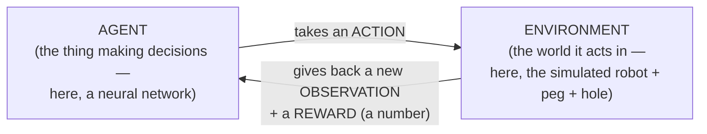

That's it — the entire loop. Everything in this project is a very elaborate, very fast, very
parallel version of this one arrow-loop. The "agent" doesn't start smart — it starts by acting
almost randomly, and gets better purely by noticing which actions tended to lead to higher
rewards.

**Core vocabulary you'll see everywhere:**

| Term | Plain meaning |
|---|---|
| **State / Observation** | What the agent currently perceives about the world |
| **Action** | What the agent decides to do |
| **Reward** | A number saying how good that action turned out to be, right now |
| **Policy** (written `π`, "pi") | The agent's strategy — a function from observation → action. In our case, this *is* the neural network |
| **Episode** | One complete attempt, from start to a natural or forced end |
| **Return** | The *total* (usually discounted) reward collected over an episode, not just one step |

---

## 1. Why a Simulator, and Why GPU-Parallel? (Isaac Lab / Isaac Sim)

**Why simulate at all, instead of training on a real robot?** A real robot doing 3.3 million
random, half-broken movements would destroy itself and take months. In simulation, "breaking"
costs nothing, resets are instant, and time can effectively be sped up.

**Why does it need to be *GPU*-parallel specifically?** Two completely different kinds of math in
this project — physics simulation, and neural network math — happen to be the *exact* kind of
computation GPUs are built for: **the same simple operation, repeated on thousands of independent
pieces of data, at the same time.**

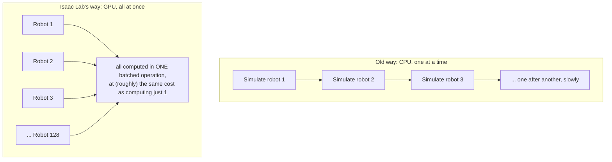

Isaac Lab sits on top of Isaac Sim's PhysX physics engine, which can run *physics itself* —
gravity, contact, friction — as a giant batched GPU operation across many cloned scenes at once
(that's what `scene.num_envs = 128` actually creates: 128 real, independent, simultaneously-existing
physical scenes, laid out in a grid so they don't collide). The neural network forward pass later
in the loop is the *exact same trick*, just applied to matrix multiplication instead of physics —
128 observations in, 128 actions out, one shot.

This is the entire reason RL-for-robotics became practical in the last few years: without
GPU-batched physics, collecting 3.3 million steps of experience the "one robot at a time" way
would take enormously longer.

---

## 2. Why Factory, and Why FORGE On Top Of It?

**Factory** is a benchmark suite (from NVIDIA's research) of *contact-rich assembly* tasks —
peg insertion, gear meshing, nut threading — chosen specifically because these are historically
**hard** for RL: success requires very high position precision (sub-millimeter) *and* reasoning
about physical contact/force, not just "move to a target."

**FORGE** extends Factory by adding realistic **force/torque sensing** — noisy force readings,
a randomized "dead zone" simulating unreliable low-force actuation, a contact-force penalty, and
a self-predicted success confidence. Why bother? Because a policy trained *only* on position data
(pure Factory) tends to not transfer well to a real robot — the last few millimeters of an
insertion are dominated by *feel* (contact force), not position, exactly the way you rely on
touch, not sight, for the final motion of putting a key in a lock. FORGE is specifically about
closing that **sim-to-real gap**.

---

## 3. One Step of the Task — State → Action → Reward → Done

This is the MDP (Markov Decision Process) loop specific to this project, at the level of *one*
robot, *one* timestep:

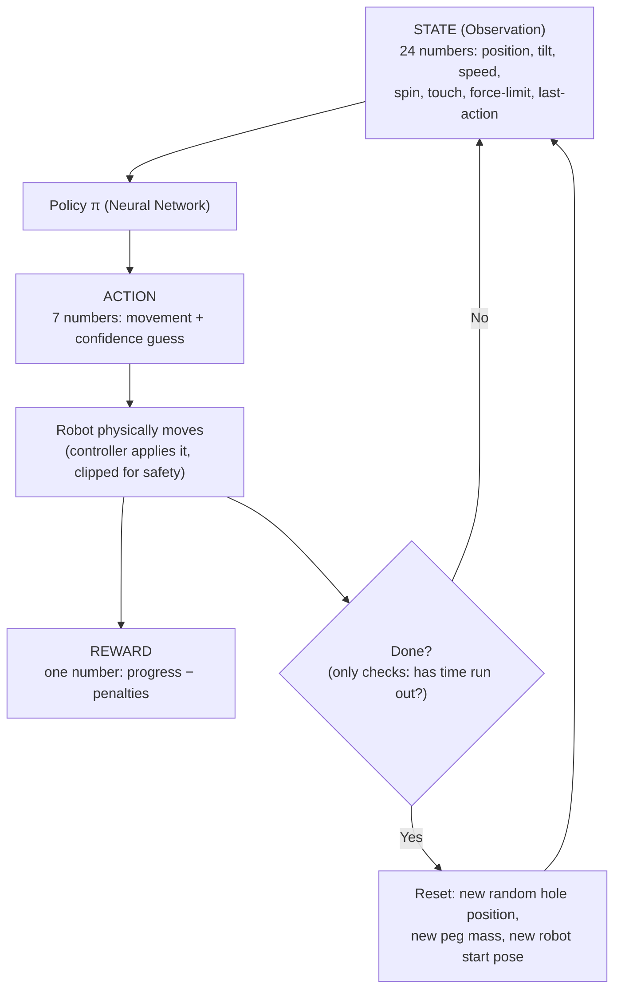

**One episode = ~150 of these steps** (10 seconds of simulated task time, at a control rate of
about 15 decisions per second). Termination here is deliberately simple — it *only* checks
"has time run out," not success/failure/dropped-part/etc. (that's a real, useful gap vs. what a
generic RL task template would lead you to expect — see the worksheet's §4).

---

## 4. The Observation Vector — What The Robot "Feels"

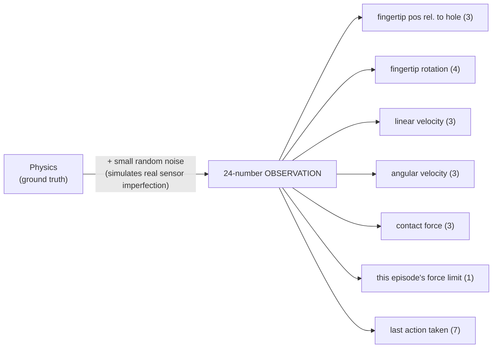

Notice: **not** raw joint angles (the generic textbook default) — everything is expressed
*relative to the target*, so the same skill ("close the gap") works no matter where the hole
randomly spawns each episode.

---

## 5. The Action Vector — What The Robot "Does"

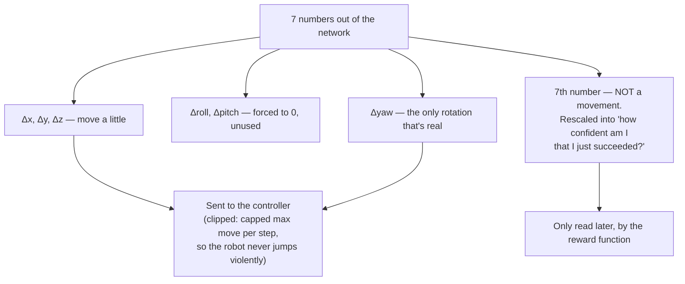

---

## 6. The Reward — What Counts As "Good"

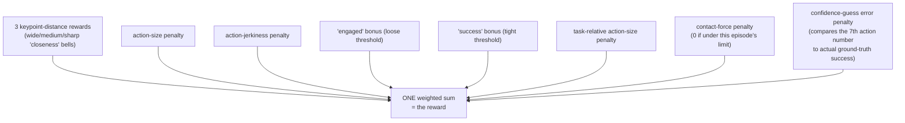

Why *three* separate distance rewards instead of one? A single sharp reward gives zero signal
from far away (nothing to learn from). A single broad reward can't drive final precision. Three
scales, stacked, give a usable gradient across the *entire* approach, from far away to
millimeter-perfect.

### The Actual Math Behind It

```
R_t = Σ_i  w_i · term_i
```
- **Plain meaning:** the final reward at this step is just a **weighted sum** — take all 10 terms
  from the diagram above, multiply each by its own importance-weight `w_i`, add them up. No
  interactions between terms, no conditionals (other than what's already built into an individual
  term, like the `relu` below) — just addition.

Three different formula "shapes" cover all 10 terms:

**Shape 1 — the closeness bell curve** (used for `kp_baseline` / `kp_coarse` / `kp_fine`):
```
squash(x, a, b) = 1 / (e^(a·x) + b + e^(-a·x))
```
- `x` = keypoint distance (how far the peg currently is from perfectly seated)
- `a` = how *narrow* the bell is — a bigger `a` means only very small `x` gets rewarded at all
- `b` = a small offset controlling the peak height
- **Plain meaning:** reward peaks when `x = 0` (perfectly aligned) and fades out smoothly as
  distance grows. `kp_baseline` uses a small `a` (wide, forgiving bell — gives signal from far
  away), `kp_fine` uses a large `a` (narrow, picky bell — only rewards near-perfect alignment).

**Shape 2 — the one-sided penalty** (used for `contact_penalty`):
```
penalty = relu(force − threshold) = max(0, force − threshold)
```
- **Plain meaning:** zero penalty as long as force stays under this episode's randomized limit;
  above it, the penalty grows one-for-one with however much force is in excess.

**Shape 3 — plain difference** (used for `success_pred_error`):
```
error = | true_success − predicted_confidence |
```
- **Plain meaning:** how far off was the network's own self-reported confidence from what
  actually happened (0 or 1)?

**Worked example** (same snapshot as earlier: peg close to the hole, 0.37N of contact force, this
episode's force limit is 5.0N, and the network's 7th action number claims 70% confidence even
though the peg isn't actually inserted yet):

| Term | Formula plugged in | Result |
|---|---|---|
| `kp_fine` | `squash(small distance, large a, b)` | ≈ **+0.9** (close → strong reward) |
| `contact_penalty` | `relu(0.37 − 5.0) = relu(−4.63)` | **0** (well under the limit — no penalty) |
| `success_pred_error` | `\|0 − 0.70\|` | **0.70** (penalized — overconfident) |
| ...(7 more terms) | ... | small positive/negative contributions |
| **Total `R_t`** | weighted sum of everything above | a **moderate positive** number — good position, dragged down by the bad confidence guess |

---

## 7. The Neural Network — What's Actually Doing the "Thinking"

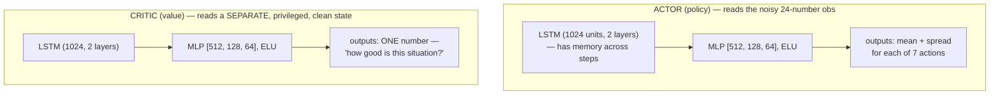

Two separate networks, not one. The **actor** only ever sees what a real robot's noisy sensors
would show it — because it's the actor that eventually gets deployed. The **critic** is allowed to
cheat and see the perfect, ground-truth simulator state — because it only exists to help training
go faster, and never has to run on real hardware. This is called an **asymmetric actor-critic**.

---

## 8. PPO, Part 1 — Collecting Experience (no learning happens here)

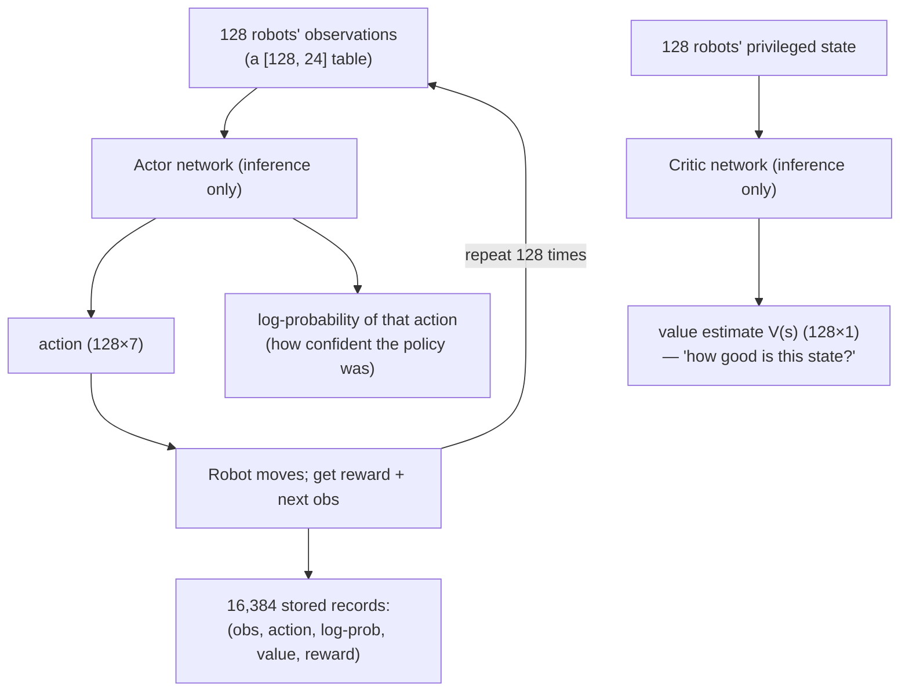

Nothing is learned in this phase — the network's weights are completely frozen. It's purely
"use the current policy, write down what happened."

---

## 9. PPO, Part 2 — The Math of Actually Learning

This is the part with real formulas. Every symbol gets a plain-English translation immediately
after it.

### Step A — How good was each action, really? (GAE — Generalized Advantage Estimation)

First, a **TD-error** at each step — "was this step better or worse than the critic expected?":

```
δ_t = r_t + γ·V(s_{t+1}) − V(s_t)
```
- `r_t` = the actual reward received at step t
- `γ` (gamma, **= 0.995** in our config) = how much future reward matters. Close to 1 = "the
  future matters almost as much as right now"
- `V(s_t)` = critic's guess of how good state t was; `V(s_{t+1})` = its guess for the *next* state
- **Plain meaning:** "reward I actually got, plus how good the critic thinks the next moment is,
  minus how good the critic thought *this* moment was." If positive, this step went better than
  predicted.

Then, the **advantage** blends these TD-errors across many future steps, not just one:

```
A_t = δ_t + (γλ)·δ_{t+1} + (γλ)²·δ_{t+2} + ...
```
- `λ` (lambda, **= 0.95**, called `tau` in the config) = a dial between "trust only the very next
  step" (λ=0) and "trust the entire rest of the episode" (λ=1). 0.95 leans toward the latter but
  not all the way — a stability/accuracy trade-off.
- **Plain meaning:** "was this action, considering everything that happened afterward, better or
  worse than average?" Positive advantage = do more of this. Negative = do less.

### Step B — Don't change the policy too aggressively (the "Proximal" part)

```
r_t(θ) = π_θ(a_t | s_t) / π_θ_old(a_t | s_t)
```
- **Plain meaning:** "how much more (or less) likely is the *updated* network to take this same
  action, compared to the network that originally took it?" If `r_t = 1.3`, the new network likes
  this action 30% more than before.

```
L^CLIP(θ) = E[ min( r_t(θ)·A_t,  clip(r_t(θ), 1−ε, 1+ε)·A_t ) ]
```
- `ε` (epsilon, **= 0.2**, called `e_clip` in the config)
- `clip(x, 0.8, 1.2)` just means: squash x so it can never go below 0.8 or above 1.2
- **Plain meaning:** normally we'd just increase the probability of good actions and decrease the
  probability of bad ones, proportional to the advantage. But if we let the ratio swing freely, one
  big lucky/unlucky batch could wildly overcorrect the whole policy in one update. The `clip`
  caps how much credit *any single update* can take — the policy is only allowed to shift by about
  20% per update, no matter how tempting the data looks. This is **the entire idea behind PPO's
  name** — stay *proximal* (close) to where you started.

### Step C — Train the critic too

```
L^VF(φ) = ( V_φ(s_t) − (A_t + V_old(s_t)) )²
```
- **Plain meaning:** the critic's guess should get closer to "advantage + what it guessed before"
  (this sum is effectively the *actual* observed return). Standard squared-error regression —
  same math as fitting a line to points, just fitting a neural network instead.

### Step D — Combine into one number to optimize

```
L(θ, φ) = L^CLIP(θ) − c1·L^VF(φ)
```
- `c1` (**= 2**, called `critic_coef`) = how much to weight getting the critic accurate, relative
  to improving the actor
- (An entropy/exploration bonus term normally goes here too, but it's turned off in this config —
  `entropy_coef: 0.0` — exploration instead comes from the Gaussian action distribution's own
  learned spread)
- This single combined number is what gradient descent actually pushes on, adjusting both
  networks' weights together, using a learning rate of `1e-4`, with gradients capped at norm `1.0`
  so no single step can be a wild swing.

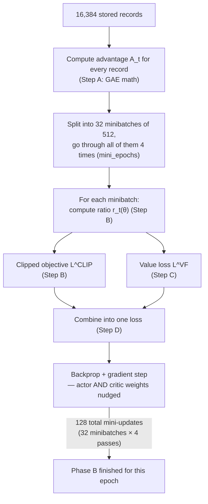

---

## 10. How Learning Actually Feeds Into the Next Epoch

A question worth asking directly: after Phase B nudges the weights, how does that "reach" Phase A
of the next epoch? Is there some copying or hand-off step?

**No hand-off needed — it's the exact same weight tensors, modified in place.** The actor and
critic aren't recreated or reloaded between epochs; Phase A always calls whatever the *current*
state of that one network object happens to be. Gradient descent in Phase B directly overwrites
those numbers. So the very next time Phase A runs, it's automatically using the updated network —
there's nothing to "feed forward," it already *is* forward.

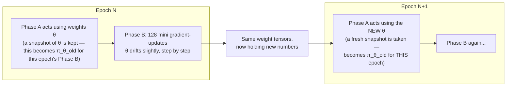

**Why the "old" vs "current" policy distinction from §9 Step B matters here:** `π_θ_old` isn't
some fixed thing from the very start of training — it's re-defined at the start of *every single
epoch's* Phase B, as "whatever the network looked like right when Phase A finished collecting."
During that epoch's 4 mini-epoch passes over the same 16,384 records, `π_θ` (the "current" network)
keeps drifting a little further from that snapshot with every one of the 128 mini-updates — which
is exactly why the clip in §9 Step B exists: by the 4th pass over the same data, the network
computing new log-probabilities is no longer quite the same network that generated the actions in
the first place, and the clip stops that gap from being exploited into an unstable jump.

This is the literal meaning of **"on-policy"**: the data an epoch learns from was collected by
(very nearly) the same policy doing the learning — not some old, frozen dataset, and not another
agent's data. Every epoch's experience is slightly "fresher" than the last, because the policy
that generated it had already learned a bit more than the one before. It's like a golfer reviewing
video of their *own* last few swings to adjust their grip, then immediately going and swinging
again with the new grip — not studying someone else's technique from a textbook.

---

## 11. The Complete Picture — All 200 Epochs, Combined

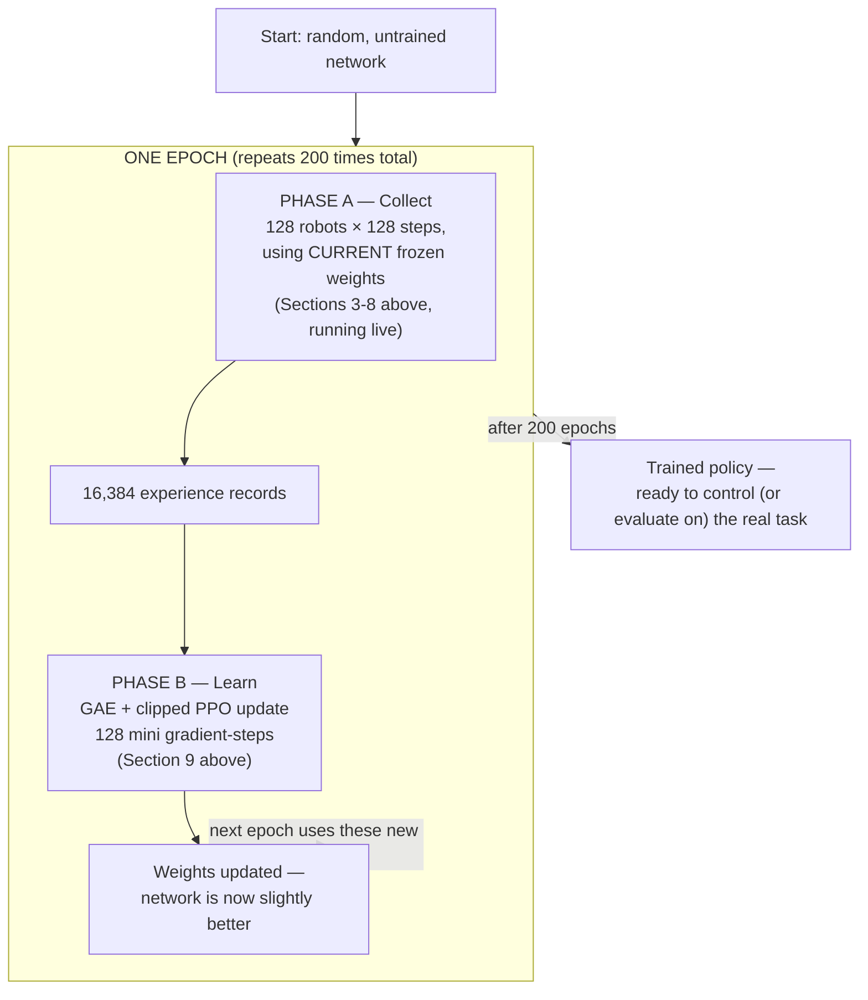

**The numbers, all tied together:**

| Quantity | Value | What it means |
|---|---|---|
| Parallel robots (`num_envs`) | 128 | How many copies of the sim run at once |
| Observation size | 24 | Numbers describing one robot's current situation |
| Action size | 7 | Numbers the network outputs (6 movement + 1 confidence) |
| One episode | ~150 steps (~10s sim time) | One robot's one full attempt |
| `horizon_length` | 128 steps | How much data to collect before pausing to learn (independent of episode length — PPO doesn't need full episodes, thanks to GAE bootstrapping; see §9 Step A and §10) |
| Buffer per epoch | 16,384 (=128×128) | Total (obs, action, reward) records collected before one learning round |
| `minibatch_size` / `mini_epochs` | 512 / 4 | How the buffer gets chopped and reused during learning: 32 minibatches × 4 passes = 128 gradient steps per epoch |
| `max_epochs` | 200 | How many times the whole collect→learn cycle repeats |
| Total experience | ≈3.3 million steps | 16,384 × 200 |
| Attempts per robot | ≈170 episodes | 3.3M ÷ 150 ÷ 128 |
| Total gradient updates | 25,600 | 200 × 128 |

---

## 12. Quick Glossary (for fast lookup)

| Term | One-line meaning |
|---|---|
| Policy (`π`) | The neural network's strategy — obs in, action out |
| Value function (`V`) | The critic's guess of how good a state is |
| Advantage (`A`) | Was this action better or worse than expected? |
| Return | Total (discounted) reward over an episode |
| Discount factor (`γ`) | How much future reward matters vs. right now |
| GAE lambda (`λ`) | How far into the future to trust when estimating advantage |
| Clip epsilon (`ε`) | Max allowed policy change per update (PPO's namesake trick) |
| Actor | The part of the network that picks actions |
| Critic | The part of the network that estimates state value (used only for training, not deployment) |
| On-policy | Learning only from data the *current* policy just generated (as opposed to old/replayed data) |
| Epoch (rl_games sense) | One full collect-then-update round — not "one pass over a fixed dataset" like in supervised ML |
| Rollout / horizon | The chunk of steps collected before pausing to learn |
| Domain randomization | Deliberately varying physical properties (mass, position, sensor noise) every episode so the policy generalizes instead of memorizing one fixed setup |
