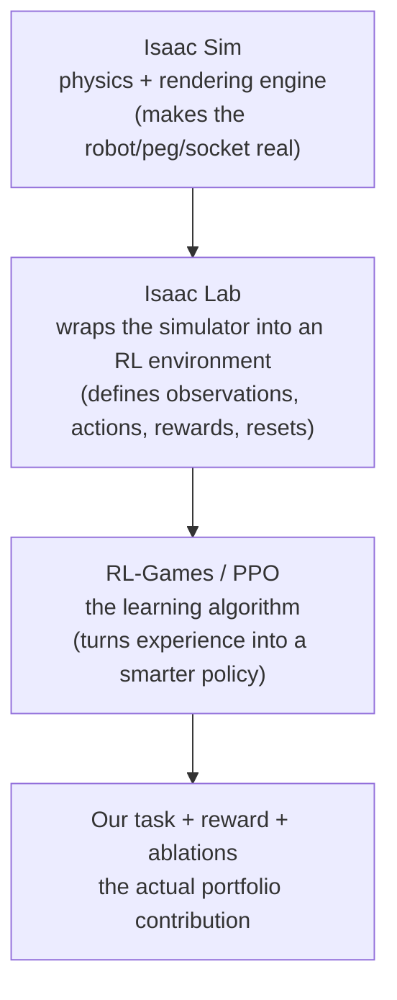
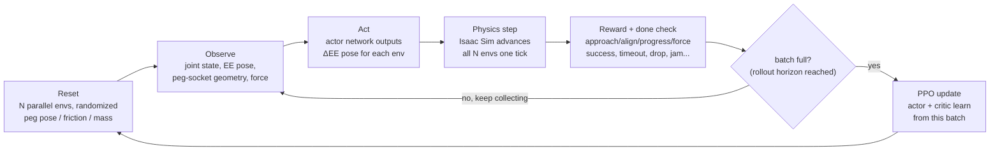
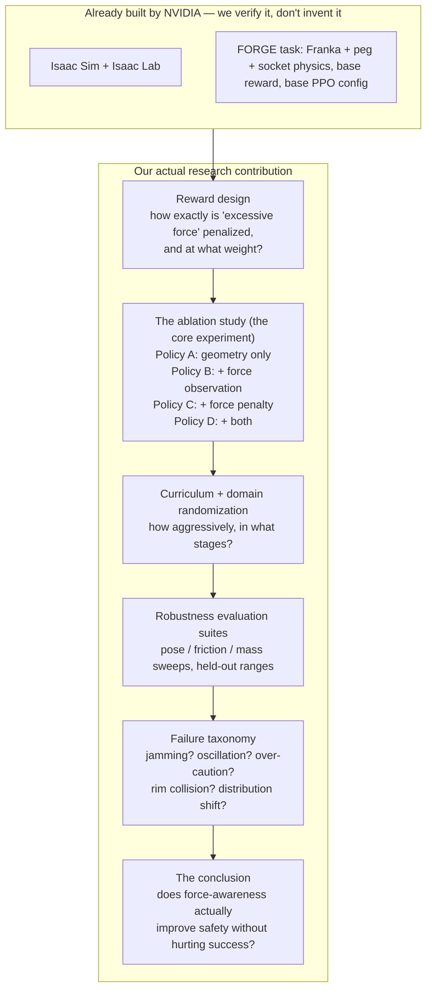

# RL Primer: What We're Building, Before We Build It

This doc exists so we never run a command without knowing *why*. It explains Isaac Lab, PPO, the
training loop we're about to trigger, and — most importantly — where the actual research happens.
Open it with Markdown Preview (VS Code) to see the diagrams rendered.

Everything we've done so far (steps 1–6: build the GPU box, install Isaac Sim + Isaac Lab, run the
two smoke tests) is **pure infrastructure**. Zero research content yet. That's intentional — see
[§7 of the project doc](../force_aware_peg_insertion_project.md): *"Do not modify the environment
during the first two days."* We're still inside that window.

---

## 1. The four layers

Only the bottom layer is ours to design. The top three are infrastructure we verify and then trust.

---

## 2. What Isaac Lab actually does for us

Isaac Sim on its own has no concept of "reward" or "episode" — it just simulates physics. Isaac Lab
is the layer that turns it into something an RL algorithm can train against. For our task,
Isaac Lab (via the FORGE peg-insertion task we're building on) defines four things:

| Isaac Lab defines | For our task, concretely |
|---|---|
| **Observation space** | joint positions/velocities, end-effector pose, peg-relative-to-socket pose, previous action, and (for force-aware policies) contact force |
| **Action space** | `[Δx, Δy, Δz, Δroll, Δpitch, Δyaw]` — a small nudge to the end-effector pose per step |
| **Reward function** | a weighted sum: approach + alignment + insertion progress + success bonus − excessive-force penalty − action penalties |
| **Reset / termination logic** | how a new episode starts (randomized peg pose) and what ends it (success, drop, timeout, force limit, jam) |

It also runs **thousands of copies of this environment in parallel on the GPU** at once
(`--num_envs 1024` etc.) — this is why RL training is fast here instead of taking days: instead of
one robot trying one insertion at a time, thousands are attempting it simultaneously every step.

---

## 3. What PPO actually is (plain terms)

**PPO = Proximal Policy Optimization.** It's the algorithm that turns "the robot tried something and
got a reward" into "the robot gets slightly better at deciding what to try."

Two networks work together:
- **Actor** — looks at the observation, outputs an action. This *is* the policy — the thing we're
  actually training and will eventually deploy/evaluate.
- **Critic** — estimates "how good is this situation, roughly?" It exists only to give the actor a
  *baseline* to compare against, so "I got +2 reward" becomes the more useful "I did better than
  expected" or "worse than expected." This cuts down noise in the learning signal.

The **"Proximal"** part is the key safety mechanism: after collecting a batch of experience, PPO
nudges the actor toward actions that worked out better than expected — but it clips how far the
policy is allowed to move in one update. Without this, a single bad batch of data could wreck a
policy that was already working. Practical analogy: a coach adjusting your free-throw form after
watching a set of shots — small corrections each round, never a total overhaul from one bad shot.

---

## 4. The training loop, step by step

One loop iteration (reset → collect a batch → update) is one **PPO iteration**. Training is this
loop repeated hundreds or thousands of times. Note: *iterations ≠ environment steps* — one iteration
processes `num_envs × rollout_horizon` steps, so more parallel envs means more experience per
iteration, not more iterations needed.

### Sanity check — does this match the plan?
Yes, term for term, against the project doc:
- Episode definition → [§9.1](../force_aware_peg_insertion_project.md#91-episode-definition)
- Observation space → [§9.2](../force_aware_peg_insertion_project.md#92-observation-space)
- Action space → [§9.3](../force_aware_peg_insertion_project.md#93-action-space)
- Reward function → [§9.4](../force_aware_peg_insertion_project.md#94-reward-function)
- Success/termination → [§9.5–9.6](../force_aware_peg_insertion_project.md#95-success-criteria)
- Training sequence (baseline → fork → Policy A → B → C → D) → [§15](../force_aware_peg_insertion_project.md#15-ppo-training-plan)

Nothing about the plan has drifted. What comes next (step 7, the tiny PPO smoke test) is literally
just running this loop for 20 iterations on the *unmodified upstream baseline* — proving the loop
works mechanically before we touch any code.

---

## 5. Where does OUR novel work actually happen?

This is the important part. Everything below the line is what makes this a research project instead
of "I ran someone else's demo."

Concretely, the research question this whole project exists to answer (from
[§1](../force_aware_peg_insertion_project.md#research-question)):

> Does adding end-effector contact-force information and an excessive-force penalty improve the
> safety and robustness of an RL policy for peg insertion?

We can't answer that by running the baseline once. We answer it by training **four variants**
(§12) with identical everything except force-observation and force-penalty on/off, evaluating all
four on the *same* deterministic episode seeds, and comparing success rate against peak contact
force. That comparison — not the Isaac Lab install — is the actual portfolio deliverable.

---

## 6. What's next

We're at the boundary between "infra" and "first real experiment": the tiny PPO smoke test
(64 envs, 20 iterations, unmodified baseline). It proves the loop above runs end-to-end and writes
a checkpoint. It is **not** training a good policy yet, and no novel work happens until after we've
read the FORGE source (roadmap step 9) and forked it into our own project (step 10+).
