# TensorBoard Guide: Every Graph Explained

Generated 2026-08-08, from the two Step-3 smoke-test runs (20 iterations, 64 envs each):

| Run | Task ID | Log dir |
|---|---|---|
| **Baseline** (force-aware, blue in every chart) | `Shaurya-ForcePegInsert-Direct-v0` | `logs/rl_games/Forge/2026-08-08_01-20-14/` |
| **Policy A** (geometry-only, orange in every chart) | `Shaurya-ForcePegInsert-PolicyA-Direct-v0` | `logs/rl_games/Forge/2026-08-08_01-34-29/` |

Both runs were 20-iteration smoke tests — enough to prove the pipeline runs and the
ablation actually removed what it was supposed to, **not** enough for the policy to
have learned to insert the peg. Treat every curve here as "does this look like a
healthy training process just getting started," not "is this a good policy."

TensorBoard itself is running locally on this machine at **http://localhost:6006/**,
watching `force_peg_rl/logs/rl_games` with a 5-second reload interval — open that
directly in a browser to see these same curves live and interact with them (zoom,
smoothing slider, toggle runs on/off). The charts below are static renders of the
exact same underlying data, generated with matplotlib directly from the
`events.out.tfevents.*` files so they're guaranteed to match what TensorBoard shows.

Every scalar in these runs is logged three times, as `<name>/iter`, `<name>/step`,
and `<name>/time` — same values, three different x-axis units (training iteration,
environment step count, and wall-clock seconds). This guide always uses `/iter`
since that's the most useful axis for comparing two runs of the same length; the
underlying number is identical on all three.

---

## 1. Episode success rate

**Tag:** `Episode/Metrics/success_rate`

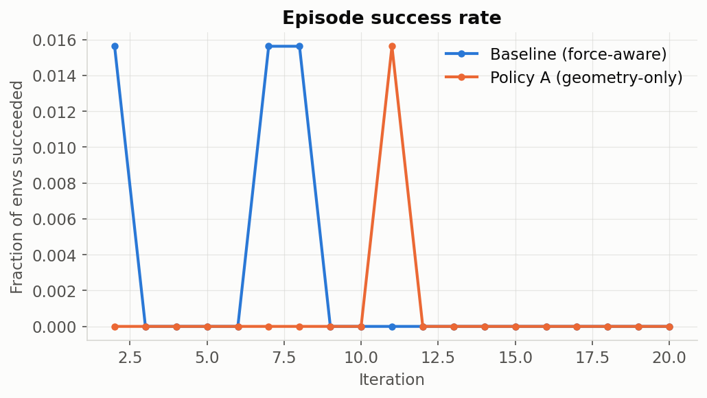

**What it is:** the fraction of the 64 parallel environments that met the task's
success condition (`_get_curr_successes()` in `factory_env.py` — peg centered
within `0.0025` xy-tolerance and below a height threshold) at the moment their
episode ended, averaged per training iteration. Comes from
`FactoryEnv._log_factory_metrics()`:
```python
self.extras.setdefault("log", {})["Metrics/success_rate"] = (
    torch.count_nonzero(curr_successes) / self.num_envs
).item()
```

**What we see:** both runs sit at or near `0.0` for almost every iteration — at
most 1/64 envs succeeding in any given iteration. That's expected: this is a
20-iteration smoke test, and PPO needs thousands of iterations to learn contact-rich
insertion from scratch. This graph is the one to watch climb toward `1.0` over a
real multi-thousand-iteration run — if it's still flat at zero after a few hundred
iterations in a real run, that's a sign something is wrong (reward not shaped
correctly, task too hard for the current curriculum stage, etc).

---

## 2. Episode length

**Tag:** `episode_lengths/iter`

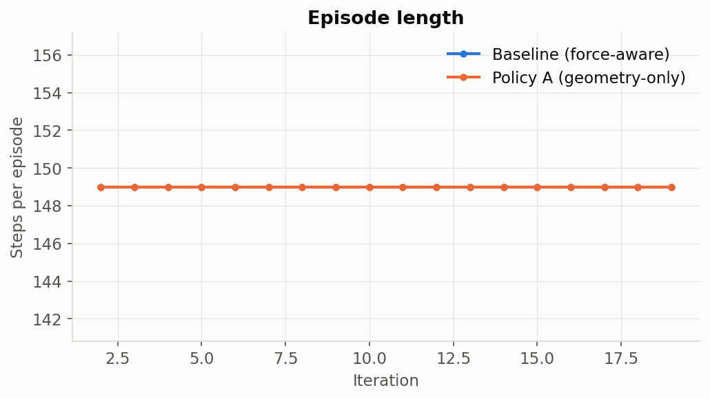

**What it is:** average number of physics steps each episode ran before reset.

**What we see:** flat at exactly `149` for every iteration, in both runs. This is
expected and, in this codebase, load-bearing: `_get_dones()` (our fork's override,
see [`docs/experiment_log.md`](experiment_log.md)) intentionally keeps every reset
synchronized — all 64 envs finish and reset together, always at the same fixed
timeout (`episode_length_s=10.0` combined with the physics/decimation settings
yields 149 steps). We chose this deliberately: `FactoryEnv.randomize_initial_state()`
(upstream, in the external `isaaclab_tasks` package) has ~200 lines of code that
assume every reset call covers *all* environments, and a genuine per-env early
termination on success/force-limit broke that assumption with a real crash
(`tensor size 64 vs 63`). So episodes still always run to the full timeout — early
success/force-limit conditions are labeled (see `termination_reason` below) but
don't end the episode early. If you ever see this line move, something upstream of
our fork changed the timeout config or the sync-reset assumption was relaxed.

**A field this graph implies but doesn't show — `termination_reason`:** our
`ForgeEnv._get_dones()` computes a per-env label (`"success"`, `"timeout"`,
`"force_limit"`, or `"other"`) every step and writes it to
`self.extras["termination_reason"]` as a numpy string array. It's *not* a
TensorBoard scalar (strings aren't plottable as a time series) — it's there for a
future evaluation script to read from logged trajectories, per
`force_aware_peg_insertion_project.md` §9.6's logging requirement. Right now, with
episode length pinned at 149 for every env, the label will read `"timeout"` for
nearly all resets and occasionally `"success"`/`"force_limit"` for envs that
crossed those conditions before the timeout — worth checking once real training
starts producing more successes.

---

## 3. Total reward (scaled)

**Tag:** `rewards/iter`

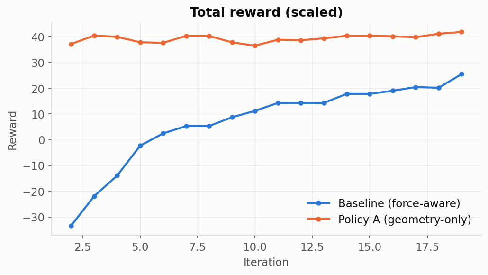

**What it is:** `rew_buf` — the actual sum RL-Games optimizes against, after all
reward-scale multipliers (`rew_scales` dict) have been applied and RL-Games' own
observation/reward normalization wrapper has run. This is the single number that
matters most for "is the policy improving," but per the project doc's own rule
(§9.4: *"Log every reward component separately. Never debug only the total
reward"*), it should never be read in isolation from the component breakdowns
further down this doc.

**What we see:** the baseline climbs steadily from about -33 to +25 over 20
iterations — classic early-training behavior, moving in the right direction.
Policy A starts already around +37 and stays roughly flat around +38 to +42. This
gap is expected and not evidence Policy A is "better": Policy A has zero contact
penalty (see §5 below) and a smaller, easier observation space, so its reward
floor sits higher from iteration 1. Comparing the *absolute* reward level between
an ablation and the baseline is not meaningful — what matters is each curve's own
trend and the component breakdown, not a head-to-head number.

---

## 4. Shaped reward (pre-clip)

**Tag:** `shaped_rewards/iter`

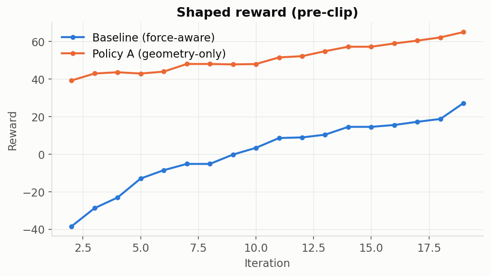

**What it is:** RL-Games' own internal reward-shaping/normalization output — this
is what the *value function* is trained against, distinct from `rewards/iter`
which is closer to the raw environment reward. The two tend to move together but
are not identical (this comes from RL-Games' `a2c_common.py`, not our env code).

**What we see:** same qualitative shape as `rewards/iter` for both runs — baseline
trending up from strongly negative, Policy A flat and higher. Useful as a sanity
check that RL-Games' internal reward pipeline isn't doing something unexpected
relative to our env's own reward.

---

## 5. Contact penalty (raw, unscaled) — the ablation proof

**Tag:** `logs_rew_contact_penalty/iter`


**What it is:** the raw (unscaled — before multiplying by `contact_penalty_scale`)
contact-force penalty term, computed in `ForgeEnv._get_rewards()`:
```python
contact_force = torch.linalg.norm(self.force_sensor_smooth[:, 0:3], ord=2, dim=-1)
if self.cfg.use_force_penalty:
    contact_penalty = torch.nn.functional.relu(contact_force - self.contact_penalty_thresholds)
else:
    contact_penalty = torch.zeros_like(contact_force)  # Policy A takes this branch
```

**This is the single most important chart in this document.** It's the direct,
literal proof that Policy A's ablation actually removed the force-penalty signal —
not just zeroed its weight in the total reward, but zeroed the *raw* term so the
logged curve itself goes flat. (An earlier, wrong version of this code would have
kept logging the real unscaled contact force even with the reward scale zeroed
out — we specifically fixed that so this chart tells the truth.)

**What we see:** baseline (blue) fluctuates between roughly 0 and 3.6 as the robot
makes and breaks contact during random early exploration. Policy A (orange) sits
at exactly `0.0` for all 20 iterations, with zero variance. That flat orange line
*is* the deliverable for `next_10_steps.md` step 4 ("confirm the
`logs_rew_contact_penalty`/force-related TensorBoard curves are now flat/absent").

---

## 6. Keypoint-distance rewards (baseline)

**Tags:** `logs_rew_kp_baseline/iter`, `logs_rew_kp_coarse/iter`, `logs_rew_kp_fine/iter`

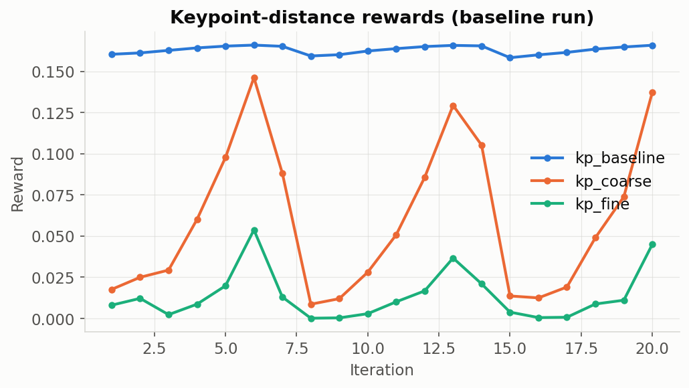

**What it is:** three reward terms computed from the same underlying quantity —
the mean distance between "keypoints" on the held peg and their target positions
on the fixed socket (`factory_utils.squashing_fn(keypoint_dist, a, b)` in
`factory_env.py`) — each passed through a different squashing curve
(`keypoint_coef_baseline`, `_coarse`, `_fine`). The three curves exist so the
reward gives useful gradient signal at every distance scale: `kp_baseline` responds
across large distances (coarse guidance when the peg is far away), `kp_fine`
only lights up once the peg is very close (precision guidance for final
insertion). This is upstream FactoryEnv/ForgeEnv logic, identical in both our
tasks — this chart is baseline-only since Policy A's geometry observations are
unchanged, so this family behaves the same in both runs.

**What we see:** `kp_baseline` stays nearly flat (~0.16 — it saturates quickly,
so it's not very informative this early). `kp_coarse` and `kp_fine` are noisier
and lower in magnitude, spiking on iterations where the random early policy
happened to get the peg closer to the target. Expect `kp_fine` in particular to
start climbing steadily only once real training has taught the policy to get
close enough for it to activate.

---

## 7. Action penalties (baseline)

**Tags:** `logs_rew_action_penalty_ee/iter`, `logs_rew_action_penalty_asset/iter`, `logs_rew_action_grad_penalty/iter`

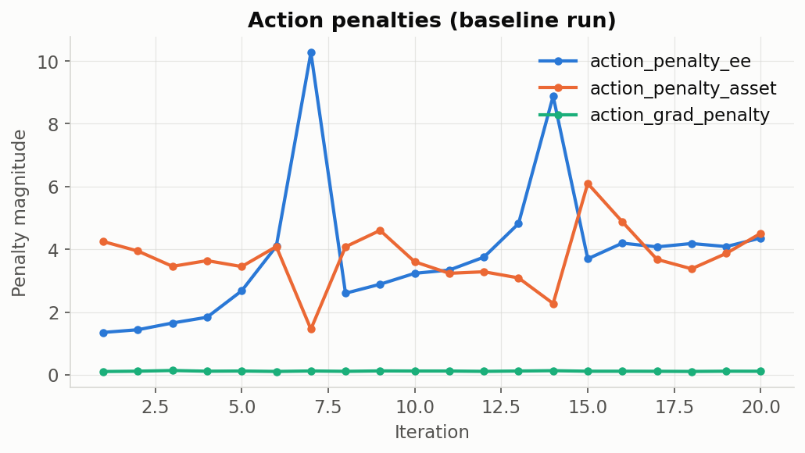

**What it is:** three different penalties on the policy's raw action output:
- `action_penalty_ee` — L2 norm of the action vector (discourages large commands
  generally), computed in the base `FactoryEnv`.
- `action_penalty_asset` — a fork-specific (`ForgeEnv`) penalty on
  position/rotation error relative to the asset-relative action frame.
- `action_grad_penalty` — L2 norm of the *change* between consecutive actions
  (discourages jerky, high-frequency control), also base `FactoryEnv`.

**What we see:** `action_penalty_ee` is the largest and most volatile of the
three (up to ~10 at iteration 7), since it's an unbounded norm on raw actions
from an untrained, near-random early policy. `action_penalty_asset` and
`action_grad_penalty` are smaller and noisier. These should generally trend down
and smooth out as the policy learns to make smaller, more purposeful, more
consistent movements.

---

## 8. Success-prediction error

**Tag:** `logs_rew_success_pred_error/iter`

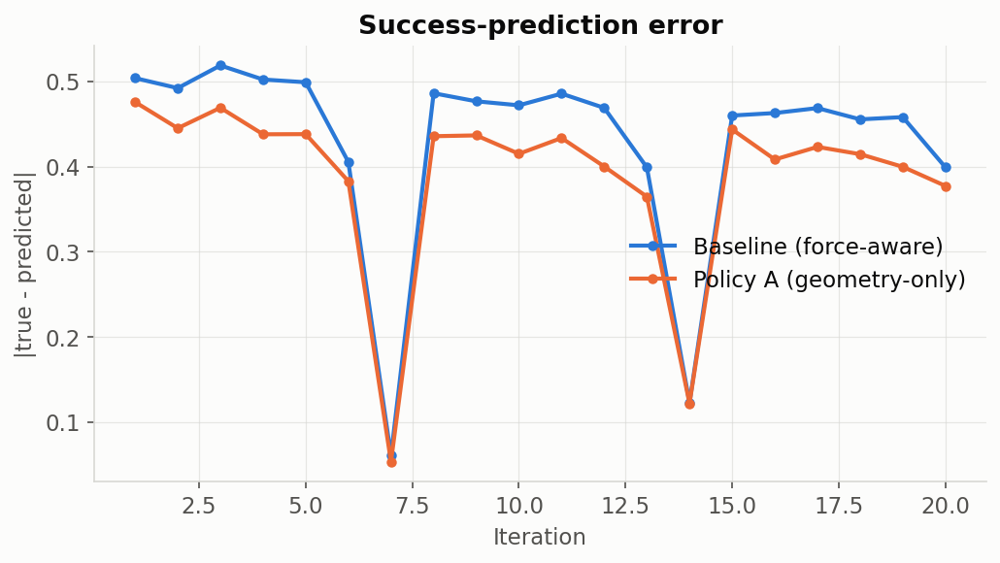

**What it is:** FORGE's distinctive 7th action dimension — the policy outputs a
"do I think I've succeeded?" self-prediction (`self.actions[:, 6]`, rescaled from
`[-1,1]` to `[0,1]`), and this term penalizes the absolute error between that
prediction and the actual ground-truth success flag:
```python
success_pred_error = (true_successes.float() - policy_success_pred).abs()
```
Per `ForgeEnv._get_rewards()`, this penalty is only turned on
(`self.success_pred_scale = 1.0`) once the true success rate crosses
`delay_until_ratio` (0.25) — early in training, with near-zero real successes,
this term is computed and logged but not yet weighted into the total reward.

**What we see:** baseline hovers mostly around 0.4-0.5 (since with a near-random
early policy and mostly-zero true successes, a mean prediction near 0.5 gives
error near 0.5). Policy A shows the same term (this part of the reward doesn't
depend on force observations) with similar behavior. Watch this drop as training
progresses and the policy's self-assessment gets calibrated against real outcomes
— that's the whole point of `early_term_precision`/`early_term_recall` below.

---

## 9. Engagement / success indicator (baseline)

**Tags:** `logs_rew_curr_engaged/iter`, `logs_rew_curr_success/iter`

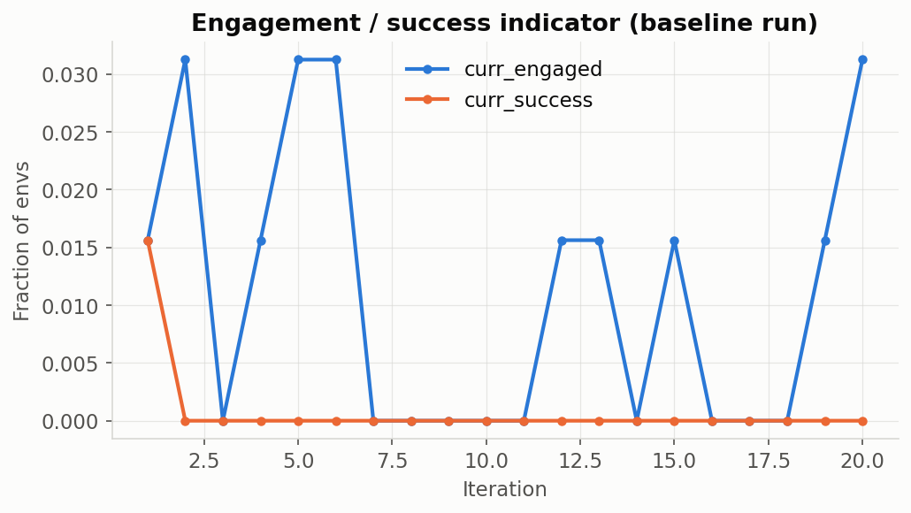

**What it is:** two boolean-valued (0 or 1, averaged across envs so effectively a
fraction) indicators from the base `FactoryEnv`:
- `curr_engaged` — a looser threshold (`engage_threshold`) than full success,
  meant to catch "peg partially inserted / in contact with socket."
- `curr_success` — the strict success condition (same one feeding
  `Episode/Metrics/success_rate` in §1, but logged here as the raw per-step reward
  term rather than the per-episode aggregate).

**What we see:** both mostly at 0 with occasional single-env blips (1/64 =
0.0156, 2/64 = 0.0312) — consistent with the near-random early policy
occasionally getting lucky. `curr_engaged` should start rising well before
`curr_success` does in a real run, since it's the easier condition to satisfy.

---

## 10. Mean success time (baseline)

**Tag:** `success_times/iter`

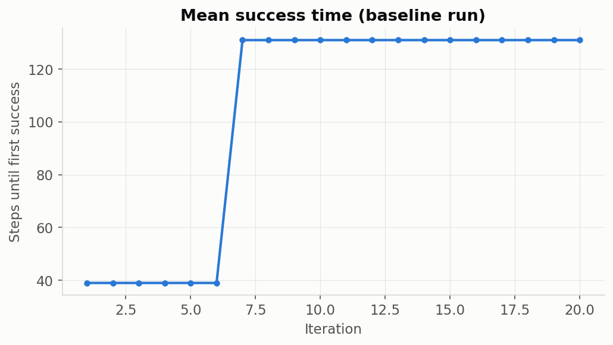

**What it is:** for episodes that *did* succeed, the mean episode step at which
the first success occurred (`self.ep_success_times`, only computed over episodes
where `ep_success_times.nonzero()` is non-empty).

**What we see:** jumps from 39 to 131 partway through the run — but with a
20-iteration smoke test and only 1-2 total successes across all 64 envs, this
number is essentially noise from a tiny sample, not a trend. In a real run with
many successes per iteration this becomes a genuinely useful "is the policy
getting faster at inserting" signal. Not plotted for Policy A here since Policy A
had even fewer successes in its smoke test (see §1) — the metric wasn't populated
often enough to be worth a comparison at this scale.

---

## 11. Early-termination precision & recall (baseline)

**Tags:** `early_term_precision/{0.5,0.6,0.7,0.8}/iter`, `early_term_recall/{0.5,0.6,0.7,0.8,0.9}/iter`

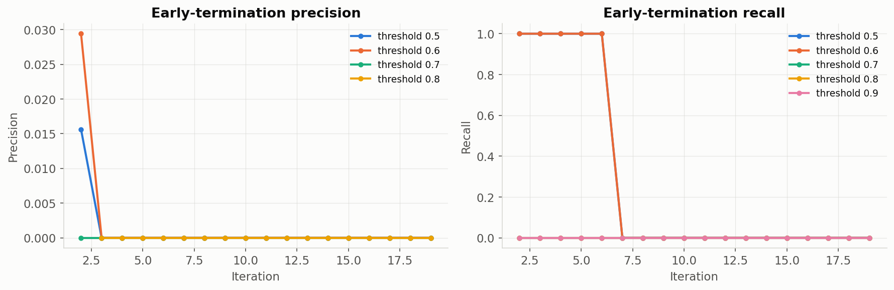

**What it is:** despite the name, this is *not* about our new `termination_reason`
early-termination work — it's an existing FORGE mechanism from
`ForgeEnv._log_forge_metrics()` that evaluates the success-*prediction* head
(§8) as a binary classifier at several confidence thresholds. For each threshold
`t` (e.g. 0.5), "predicted success" = the first step where
`policy_success_pred > t`. Then:
- **Precision** — of episodes where the policy predicted success at threshold
  `t`, what fraction had a real success occur *before* that predicted point?
- **Recall** — of episodes that really did succeed, what fraction did the policy
  predict (at any point) before or by the real success?

**What we see:** mostly 0 across both metrics and all thresholds, again because
real successes are extremely rare in a 20-iteration smoke test — there isn't
enough positive-class data yet for these to be meaningful. This pair becomes
useful once training has produced enough real successes to evaluate the
self-prediction head's calibration against.

---

## 12. Success-prediction delay (baseline)

**Tags:** `early_term_delay_all/{0.5,0.6}/iter`, `early_term_delay_correct/{0.5,0.6}/iter`

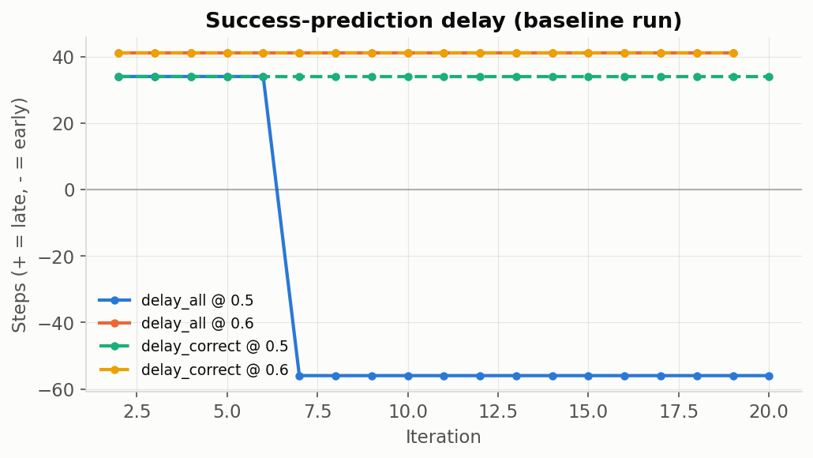

**What it is:** how many steps *after* (positive) or *before* (negative) the real
success moment the policy's self-prediction crossed each threshold —
`delay_all` includes every case where both a real and predicted success time
exist; `delay_correct` restricts to cases where the prediction came at or after
the real success (i.e., excludes cases where the policy "predicted" success too
early to be meaningful).

**What we see:** step changes (e.g. `delay_all/0.5` jumping from 34 to -56
partway through) reflecting which handful of episodes happened to succeed in
that iteration — again, noise from a very small sample in a smoke test, not yet
a meaningful trend.

---

## 13. Actor & critic losses

**Tags:** `losses/a_loss`, `losses/c_loss`

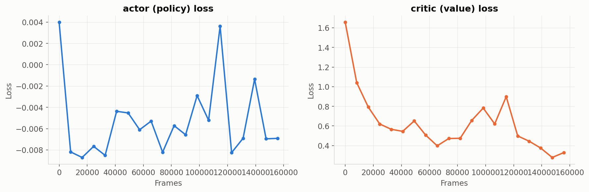

**What it is:** the two core PPO training losses, logged once per RL-Games
training epoch (1 epoch ≈ 1 iteration here — 20 epochs total, matching the
`--max_iterations 20` smoke test) but plotted against cumulative frame count
(0 to 155648) rather than epoch index, since that's the `step` value RL-Games
attaches to these particular scalars:
- `a_loss` — the clipped-surrogate PPO policy-gradient loss.
- `c_loss` — the value-function (critic) regression loss, predicting expected
  future return from the 61-dim (baseline) / 57-dim (Policy A) privileged state.

**What we see (baseline):** `c_loss` starts high (~1.66) and drops sharply to
~0.3-0.4 within the first ~40,000 frames — the value function is quickly learning
to predict returns better than its random initialization, which is expected and
healthy. `a_loss` is much smaller in magnitude and noisier around zero, typical
for PPO's clipped objective early in training.

---

## 14. Policy entropy & action-bounds loss

**Tags:** `losses/entropy`, `losses/bounds_loss`

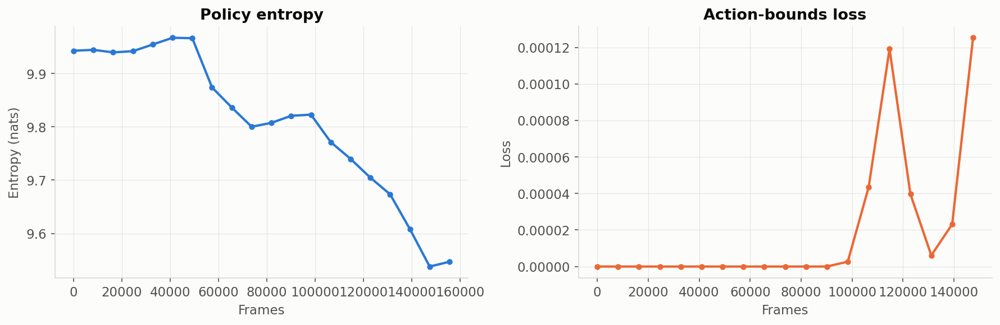

**What it is:** `entropy` measures how random/exploratory the policy's action
distribution still is (higher = more random); it should trend downward over a
full training run as the policy becomes more confident and deterministic, but
dropping too fast can mean premature convergence / insufficient exploration.
`bounds_loss` penalizes the policy for outputting actions outside the expected
`[-1, 1]` range before squashing.

**What we see:** entropy starts around 9.95 and drifts down to ~9.5 over the
run's ~155,000 frames — a small, expected early dip, nowhere near converged (with 7 continuous
action dimensions, max entropy is much higher than the per-dimension case would
suggest — 9.5-9.95 nats is a plausible range for a near-random continuous
policy this early). `bounds_loss` stays essentially at 0 throughout, meaning the
policy isn't yet frequently trying to exceed the valid action range.

---

## 15. KL divergence & learning rate

**Tags:** `info/kl`, `info/last_lr`

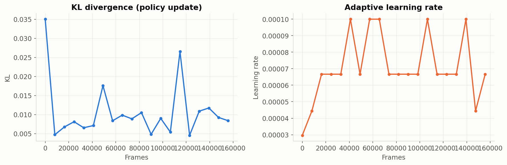

**What it is:** `kl` is the measured KL-divergence between the policy before and
after each PPO update — this is what RL-Games' adaptive learning-rate scheduler
actually watches. `last_lr` is that scheduler's current output: when KL creeps
above a target band the learning rate is reduced (and vice versa), per the
config in `agents/rl_games_ppo_cfg.yaml`.

**What we see:** `kl` starts with one large spike (~0.035 at frame 0 — normal,
first update from network initialization) then settles into a low, noisy band
(0.005-0.012). `last_lr` correspondingly jumps around in the `3e-5` to `1e-4`
range as the scheduler reacts — this back-and-forth is the scheduler doing its
job, not a problem.

---

## 16. Simulation throughput & step time

**Tags:** `performance/step_fps`, `performance/step_time`

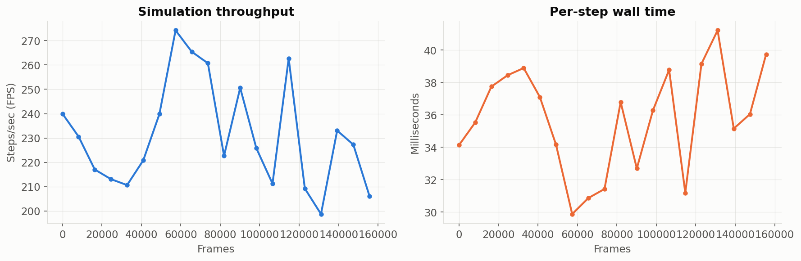

**What it is:** pure infrastructure/hardware metrics, unrelated to the policy or
reward — `step_fps` is simulated-environment-steps-per-second across all 64
parallel envs; `step_time` is milliseconds per step. Useful for noticing hardware
regressions or contention, not for judging training quality.

**What we see:** roughly 200-270 steps/sec, 34-40ms per step on this DGX Spark
GB10 GPU at `num_envs=64` — expect this to change (not necessarily linearly) at
the larger `num_envs=1024` used for real training runs, since GPU parallelism
scales differently than a small smoke test predicts.

---

## Tags that exist but aren't graphed here

A few scalar families were skipped as redundant or not yet meaningful at
smoke-test scale:
- `info/cval_lr`, `info/e_clip`, `info/epochs`, `info/lr_mul` — mostly-static
  config values (an unused parallel critic learning rate, the fixed PPO clip
  range, an epoch counter, and a learning-rate multiplier that stayed at 1.0
  throughout both runs) rather than something you'd read a training-health
  signal off of.
- `performance/rl_update_time`, `performance/step_inference_fps`,
  `performance/step_inference_time`, `performance/step_inference_rl_update_fps`
  — finer-grained breakdowns of the same throughput picture as §16, split by
  which part of the step loop (env step vs. policy inference vs. gradient
  update) consumed the time. Useful for profiling a real slowdown, not needed
  for a routine read of training health.

---

## Reproducing these charts

```bash
# TensorBoard itself (already running on this machine):
tensorboard --logdir force_peg_rl/logs/rl_games --reload_interval 5 --port 6006
# then open http://localhost:6006/

# Static re-renders of the same data (what generated the PNGs above):
python3 docs/assets/tensorboard/gen_charts.py  # see script for the exact tags/paths used
```
